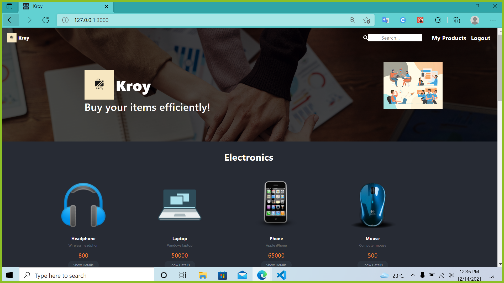
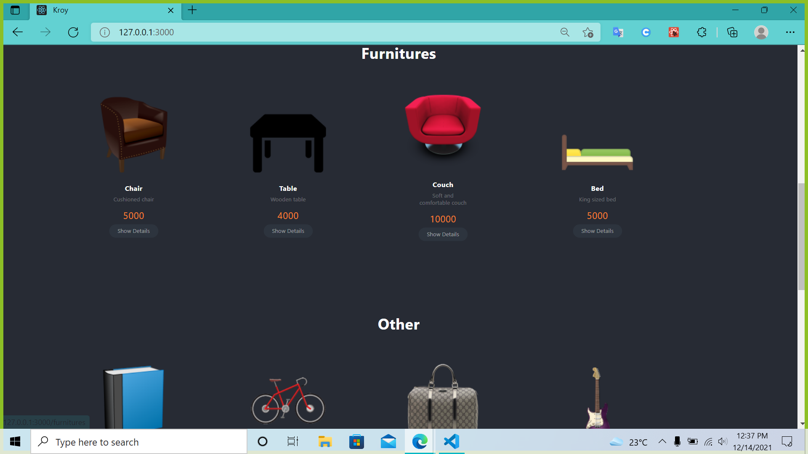
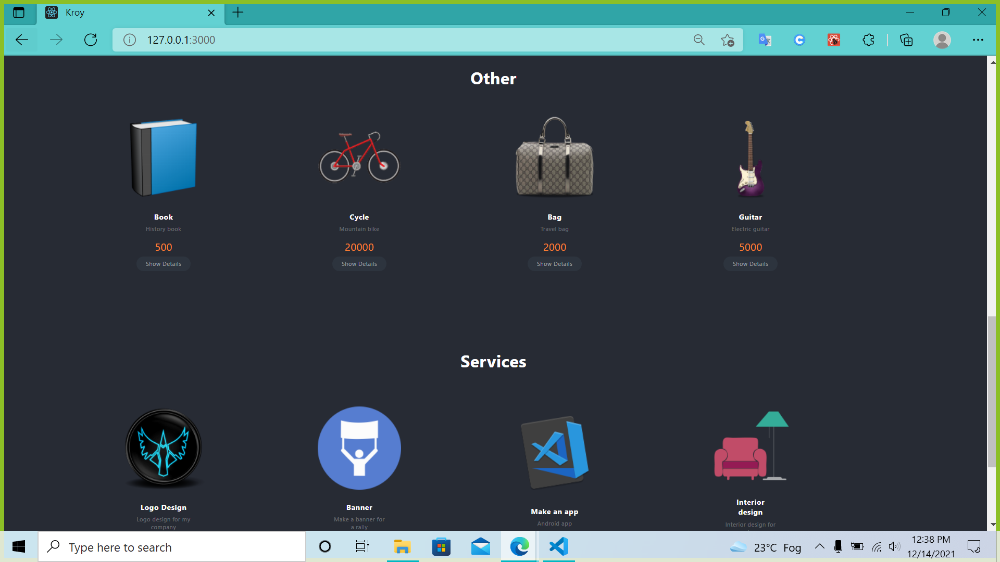
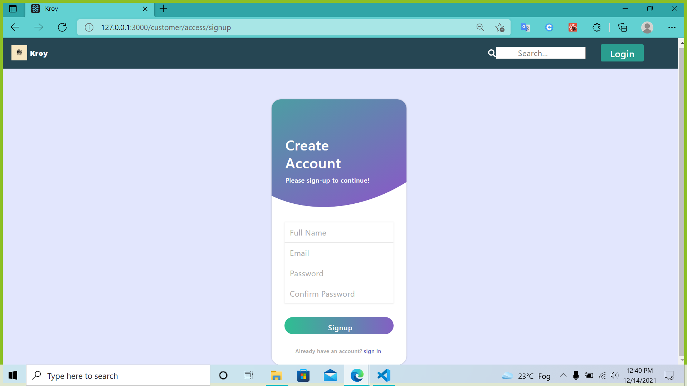
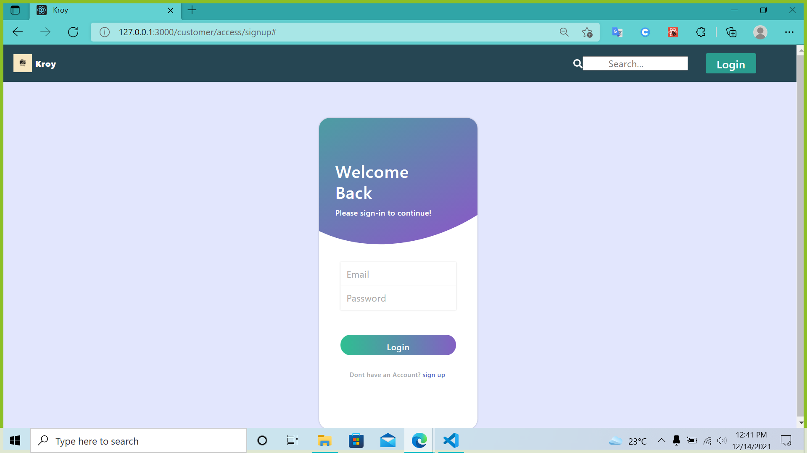
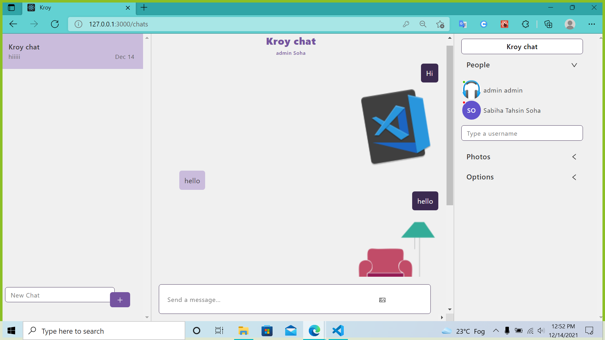
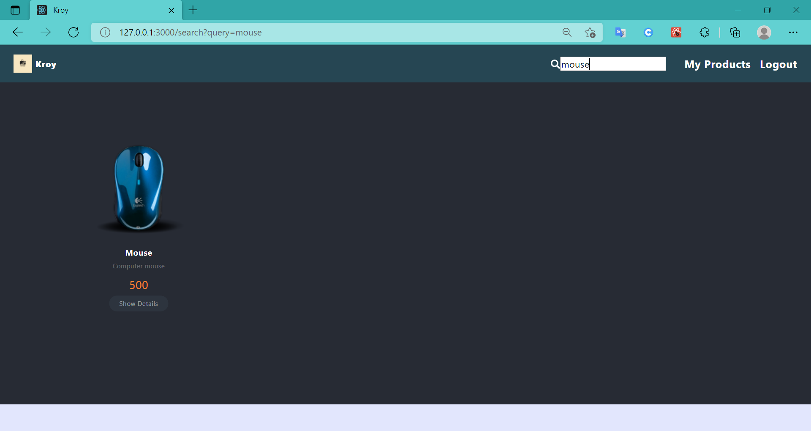

#  Kroy: An efficient way to buy

<p align=center>

     
</p>

##  Motivation

A common dilemma that every buyer faces is where to buy a specific product from. What do we do when we first think of buying something? We decide our budget and look for them in physical or online stores. Then comes endless hours of searching and surfing. What if we tell you that there is an easier alternative? Our web app <b>Kroy</b> opens a new door for buying stuff in an efficient way. Our goal is to change the way we buy things in general. Here, buyers will be able to post about the product they want by mentioning their budget and personal requirements. Someone who is willing to sell that very product will be able to bid within that budget. 
Also, there will be a service section where you can ask for any service that you want and bidders will make sure that your needs are met.

## Video presentation for the project

The detailed overview of the app and how to use it can be found in the following video. Click the thumbnail below to watch it on Youtube:

[](https://youtu.be/_dFDs0SEENY)

##  Features


* User Authentication

	* Login 

	* Register

* Product and Service section 
* Individual product and service details section
* Perform CRUD (Create, Read, Update, Delete) operations on products and services
* Bid for a posted product or service
* Notification system on bid completion

* List for posted bids
* Realtime chat between sellers and buyers with the ability to upload images

* Checkout and payment gateway for order confirmation

* Search for any product or service using the searchbar
* User friendly UI

##  Used Technologies:

<ul>

<li>Frontend: React.js </li>
<li>Backend: Django, Node.js, Express.js</li>
<li>Database: MySQL</li>


</ul>


##  Run the Project in your Machine

Move into the storefront folder:

```

cd storefront

```
Install virtual environment and Django:

```

pip install pipenv
pipenv install django

```

Activate the virtual environment and run the server :

```

pipenv shell
pipenv run python manage.py runserver

```

Move into the payment folder

```

cd payment

```
Install the necessary packages and run the server

```

npm install
node app.js

```

Move into the frontend folder

```

cd frontend
cd ecom

```
Install the necessary packages and run the frontend

```

npm install
node app.js

```


#  Some Snapshots:

<p align="center" >

 </p>
 </p>
 </p>
 </p>
 </p>
 </p>
 </p>
 </p>
 </p>
 </p>
 </p>
 </p>
 </p>
 </p>
 </p>
 </p>
 </p>
 </p>
 </p>
 </p>
 </p>


##  Authors

- <b>[Sabiha Tahsin Soha (2017331096)](https://github.com/tahsinsoha)</b>

- <b>[Aritra Mazumder (2017331073)](https://github.com/Aritra741)</b>
